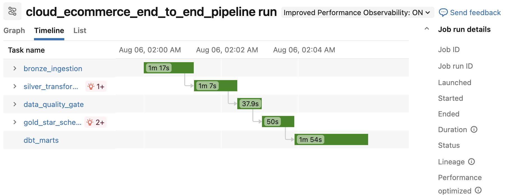
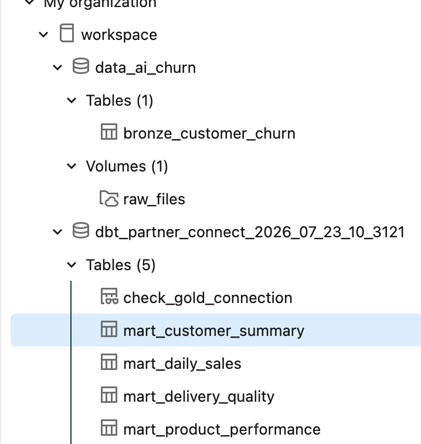
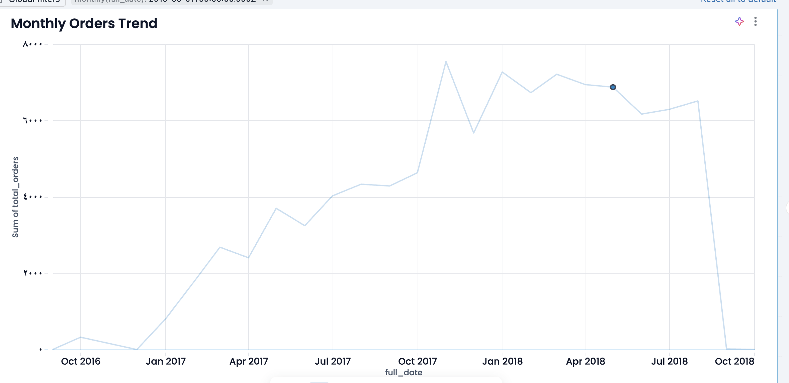

# Cloud E-commerce Data Platform

An end-to-end cloud data engineering platform built with **Databricks, PySpark, Delta Lake, Unity Catalog, dbt, Lakeflow Jobs, and Databricks AI/BI Dashboards**.

The project demonstrates how raw e-commerce data can be ingested, transformed, validated, modeled, orchestrated, and delivered for analytics using a modern lakehouse architecture.

---

## Project Overview

The goal of this project is to build a complete data engineering pipeline for e-commerce data.

The platform processes raw CSV datasets through multiple data layers, applies data quality checks, builds an analytical star schema, creates business-ready dbt marts, automates the entire workflow, and exposes the final data through interactive dashboards.

### End-to-End Flow

```text
Raw CSV Files
      ↓
Bronze Layer
      ↓
Silver Layer
      ↓
Data Quality Gate
      ↓
Gold Star Schema
      ↓
dbt Data Marts
      ↓
AI/BI Dashboards
```

The complete workflow is orchestrated using **Databricks Lakeflow Jobs**.

---

## Architecture

The project follows the **Medallion Architecture** pattern.

### Bronze Layer

The Bronze layer stores raw ingested data with minimal transformation.

Seven raw Delta tables were created:

* `customers_raw`
* `orders_raw`
* `order_items_raw`
* `payments_raw`
* `reviews_raw`
* `products_raw`
* `sellers_raw`

This layer preserves the original source data and provides a reliable starting point for downstream processing.

### Silver Layer

The Silver layer performs cleaning and standardization.

Transformations include:

* Data type correction
* Null handling
* Duplicate handling
* Timestamp standardization
* Data normalization
* Relationship validation
* Business-rule validation

The cleaned datasets are stored as Delta tables for further processing.

### Data Quality Layer

A dedicated data quality stage validates the data before it reaches the Gold layer.

Checks include:

* Null checks
* Duplicate checks
* Primary-key validation
* Referential-integrity checks
* Record-count validation
* Business-rule validation

Critical checks act as a **quality gate**, preventing downstream processing when important validation rules fail.

Data quality results are stored in:

```text
workspace.ecommerce_monitoring.data_quality_results
```

---

## Gold Layer

The Gold layer contains an analytics-ready **Star Schema**.

### Dimension Tables

* `dim_customers`
* `dim_products`
* `dim_sellers`
* `dim_date`

### Fact Tables

* `fct_orders`
* `fct_order_items`

This design supports efficient analytical queries and business reporting.

---

## dbt Transformation Layer

dbt is used on top of the Gold layer to create business-oriented analytical marts.

### dbt Models

#### `mart_daily_sales`

Provides daily sales and order metrics including:

* Total orders
* Delivered orders
* Total items
* Order value
* Payment value
* Average order value
* Late orders
* Late delivery rate
* Average review score

#### `mart_product_performance`

Provides product-level performance metrics including:

* Orders
* Units sold
* Product revenue
* Freight value
* Gross sales
* Average item price
* Delivery performance

#### `mart_customer_summary`

Provides lifetime customer metrics including:

* Total orders
* Total purchased items
* Lifetime order value
* Lifetime payment value
* Average order value
* First order
* Latest order
* Late orders
* Average review score

#### `mart_delivery_quality`

Tracks delivery performance by month and customer state.

Metrics include:

* Total orders
* Delivered orders
* Late orders
* On-time orders
* Late delivery rate
* Average delivery time
* Review score
* Payment value

### dbt Testing

dbt tests are used to validate analytical models.

Examples include:

* `not_null`
* `unique`
* Key validation
* Important metric validation

The production dbt Catalog contains:

```text
5 Models
6 Sources
16 Tests
```

---

## Orchestration

The complete pipeline is automated with **Databricks Lakeflow Jobs**.

The tasks execute sequentially:

```text
bronze_ingestion
        ↓
silver_transformation
        ↓
data_quality_gate
        ↓
gold_star_schema
        ↓
dbt_marts
```

Each stage depends on the successful completion of the previous stage.

The pipeline is configured for scheduled execution.



---

## dbt Catalog

dbt provides model documentation, testing information, and dependency visibility for the analytical layer.



---

## Analytics Dashboard

Databricks AI/BI Dashboards are used to expose business insights from the final data marts.

### Sales Overview

The dashboard includes:

* Total Orders
* Delivered Orders
* Total Revenue
* Monthly Orders Trend
* Monthly Revenue Trend



### Product Performance

Product analytics include:

* Top 10 Product Categories by Revenue
* Top 10 Product Categories by Units Sold


### Delivery Quality

Delivery analytics include:

* Average Delivery Days
* Late Orders
* Late Orders Trend

---

## Technology Stack

| Area                  | Technology                  |
| --------------------- | --------------------------- |
| Cloud Data Platform   | Databricks                  |
| Data Processing       | PySpark                     |
| Querying              | SQL                         |
| Storage Format        | Delta Lake                  |
| Governance            | Unity Catalog               |
| Architecture          | Medallion Architecture      |
| Data Modeling         | Star Schema                 |
| Analytics Engineering | dbt                         |
| Data Quality          | PySpark + dbt Tests         |
| Orchestration         | Databricks Lakeflow Jobs    |
| Visualization         | Databricks AI/BI Dashboards |
| Version Control       | Git & GitHub                |

---

## Repository Structure

```text
cloud-ecommerce-data-platform/
│
├── notebooks/
│   ├── 00_setup.py
│   ├── 01_ingestion.py
│   ├── 01_pyspark_environment.py
│   ├── 02_bronze_tables.py
│   ├── 03_silver_tables.py
│   ├── 04_data_quality.py
│   └── 05_gold_star_schema.py
│
├── dbt/
│   ├── dbt_project.yml
│   │
│   └── models/
│       ├── sources.yml
│       ├── check_gold_connection.sql
│       │
│       └── marts/
│           ├── mart_daily_sales.sql
│           ├── mart_customer_summary.sql
│           ├── mart_product_performance.sql
│           ├── mart_delivery_quality.sql
│           └── marts.yml
│
├── docs/
│   ├── pipeline.png
│   ├── dbt_catalog.png
│   ├── sales_dashboard.png
│   └── analytics_dashboard.png
│
├── .gitignore
├── LICENSE
└── README.md
```

---

## Key Engineering Concepts Demonstrated

This project demonstrates practical experience with:

* End-to-end data pipeline development
* Cloud lakehouse architecture
* Medallion Architecture
* ETL / ELT
* PySpark transformations
* Delta Lake
* Data quality validation
* Data modeling
* Fact and Dimension tables
* Star Schema
* dbt models
* dbt tests
* dbt documentation
* Data lineage
* Unity Catalog
* Workflow orchestration
* Pipeline dependencies
* Production scheduling
* Analytics dashboards

---

## Challenges and Lessons Learned

One of the main challenges was integrating **dbt Platform with Databricks**.

During implementation, several issues were encountered including:

* Database credential configuration
* Databricks warehouse connectivity
* dbt deployment configuration
* Unity Catalog permissions
* `CREATE TABLE` permissions
* `MODIFY` permissions
* Production environment configuration
* dbt Platform Job integration with Databricks

These issues were resolved by analyzing execution logs, configuring the correct warehouse connection and credentials, granting the required Unity Catalog permissions, and validating each layer independently before running the full pipeline.

This process reinforced the importance of:

* Reading pipeline logs carefully
* Separating authentication issues from authorization issues
* Validating individual pipeline stages
* Designing reliable dependency chains
* Implementing data quality gates before analytical processing

---

## Project Outcome

The final result is an automated cloud data platform that transforms raw e-commerce files into validated, analytics-ready datasets.

The complete production workflow is:

```text
CSV
 ↓
Databricks
 ↓
Bronze
 ↓
Silver
 ↓
Data Quality
 ↓
Gold Star Schema
 ↓
dbt Marts & Tests
 ↓
AI/BI Dashboard
```

The project demonstrates the complete lifecycle of a modern data engineering solution, from ingestion and transformation to orchestration and analytics.
